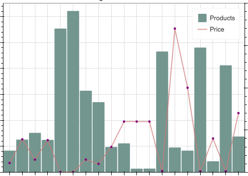

----------------------------------
| # Welcome to My Portfolio Page |
----------------------------------

### Project 1: Analyzing Sales Data on Electronic online store

#### [Click here to see Project Showcase](project1.html)
These project are the result of analysis of sales data obtained from an electronic online store, and are intended to predict which products can increase the sales of this electronic online store, in the coming years.

From the sales data obtained from this electronic online shop, questions from client arise that are used to analyze existing data.

##### This are the questions from a client:
1. What time should we display advertisement to maximize customer buying product?
2. What product sold the most?
3. What is best month for sales? How much was earned that month?
4. What city had the highest number of sales?

#### Project details
* Observe and analyze sales data to help client predicted they're sales goals in the future.
* Collected data from csv/excel files and using it for Exploratory Data Analysis (EDA).
* Cleaning and fixing error data using Python.
* Using Python calculated the need it data to get the result what client wants.
* Making graphic chart to showing the results.
* Created a web application dashbord with Python.
